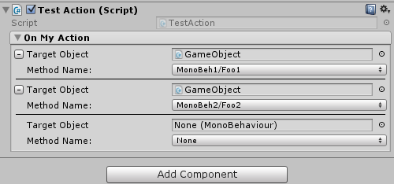

## EditorDelegate
Just define in your class property, like:
```c#
public Action onMyAction;
```
And call `Execute()` method to invoke listeners:
```c#
onMyAction.Execute();
```
In Editor you can add any number of delegates:<br>
 <br>
But callback function must return void and has no params, like:
```c#
public void Foo() {}
```
It works as a signal. 

## Author
[https://www.linkedin.com/in/ierostenko](https://www.linkedin.com/in/ierostenko)
